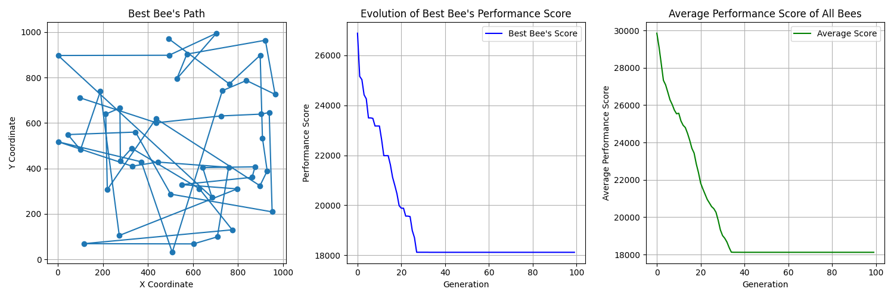

# Bee Evolution Simulation

This project simulates the evolution of a bee colony's knowledge of a field of flowers using a genetic algorithm. The bees explore the field, and the most successful ones pass their knowledge to the next generation.

## Problem Statement

The problem is inspired by the behavior of bees foraging for nectar in a field of flowers. The goal is to optimize the path that bees take to visit all the flowers efficiently.

## Usage

1. **Clone the repository:**

   git clone https://github.com/your-username/miel-abeilles.git

2. **Navigate to the project directory:**

   cd miel-abeilles

3. **Install required dependencies:**
    pip install -r requirements.txt

4. **Run the simulation:**
    python main.py

This will execute the genetic algorithm to simulate the evolution of bee knowledge.

## Files
beehive.py: Contains the implementation of the Bee and Beehive classes that represent individual bees and the bee colony, respectively.

main.py: The main script to run the simulation. It initializes the bee colony, evolves the generation, and visualizes the results.

flowers.csv: CSV file containing the coordinates of flowers in the field.

## Visualizations

The simulation generates visualizations, showcasing key aspects of the evolutionary process:

### Bee Path

The path taken by the best-performing bee is visualized, illustrating the optimized route through the field of flowers.

### Evolution of Best Bee's Performance Score

A plot depicting how the performance score of the best-performing bee evolves over generations is provided. This visual representation helps track the improvement in efficiency.

### Average Performance Score of All Bees

The evolution of the average performance score of all bees in the colony is displayed. This graph illustrates the overall progress of the bee colony in navigating the field.

## Parameters and Customization

Customize the simulation by adjusting the following parameters in the `main.py` file:

- **NUM_BEES**: Number of bees in the colony.
- **NUM_GENERATIONS**: Number of generations for the simulation.

Modify these values based on your preferences to observe different behaviors and outcomes in the bee evolution simulation.

